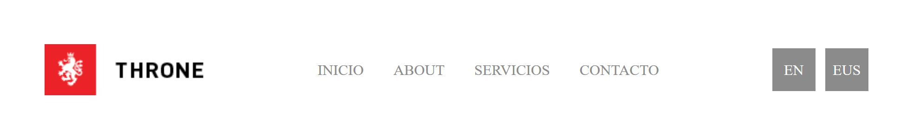

# Ejercicio 1: Menú horizontal

- Crea un menú como el de la imagen, compuesto por un logotipo, una lista de elementos de navagación y dos enlaces para cambio de idioma.

- La distancia entre bloques tiene que ser la misma.

- Logotipo: http://throne.stonedthemes.com/wp-content/uploads/2015/08/logo.png