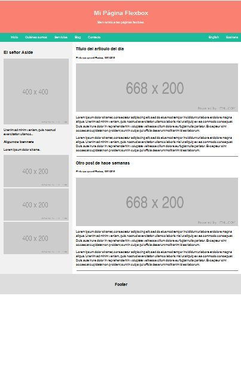

# Layout completo

- Crea una página como la de la imagen, compuesta por: header, menú, barra lateral, contenido tipo blog y footer.

- El ancho máximo de la página completa será de 1000px, y la proporción de las columnas es 
30%-70%.

- El footer tiene que aparecer siempre al borde 
inferior de la página.