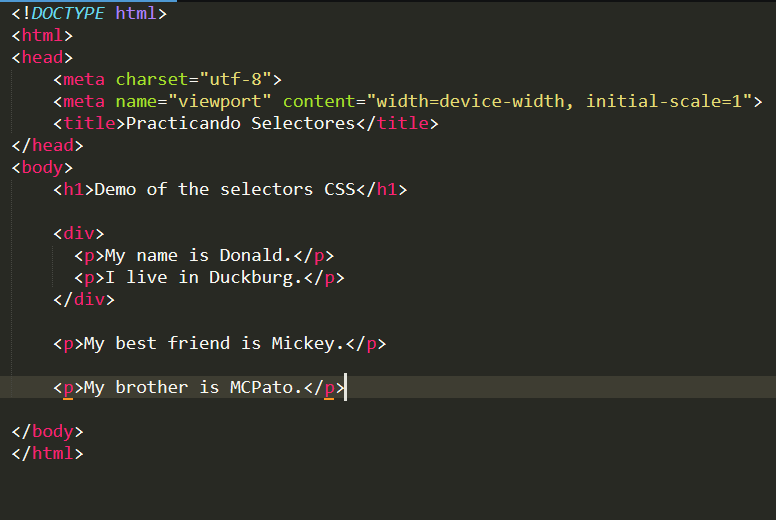

de acuerdo el siguiente código html (no modificar el código html, ni agregar id, ni tampoco clases a las etiquetas); Ponle el tamaño de letra de 30px a las últimas **P** que estan despues del **DIV**

