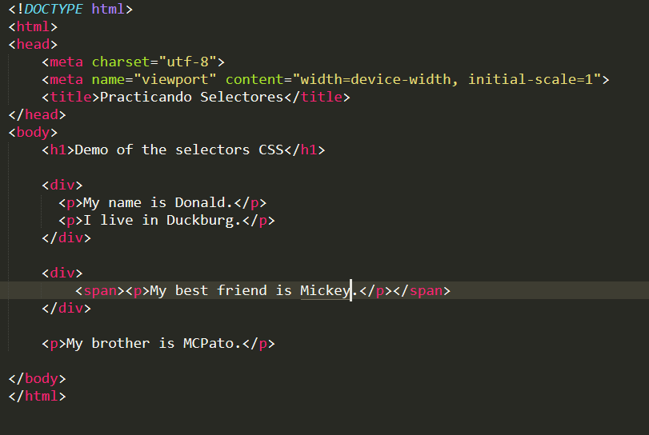

De acuerdo el siguiente código html (no modificar el código html, ni agregar id, ni tampoco clases a las etiquetas); Ponle un color de letra a la **P** que se encuentra dentro del **SPAN** utilizando el selector **>**.

