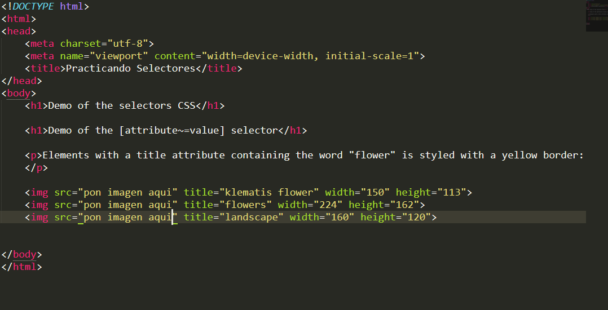

de acuerdo el siguiente código html (no modificar el código html, ni agregar id, ni tampoco clases a las etiquetas); Pon imágenes y después utilizando la siguiente propiedad css **border: 5px solid yellow;** ponle un border a la primera imagen utilizando el selector de atributos **[]**.

