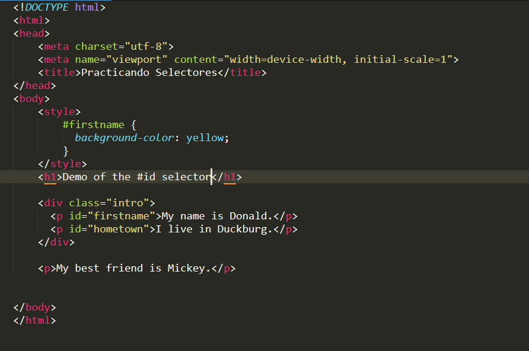

de acuerdo el siguiente código html (no modificar el código html, ni agregar id, ni tampoco clases a las etiquetas); ponle un color de fondo a las **P**, investiga sobre la palabra **!important**.

